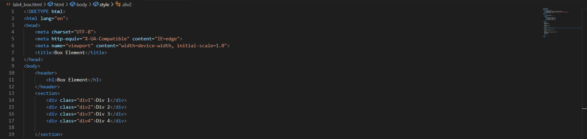
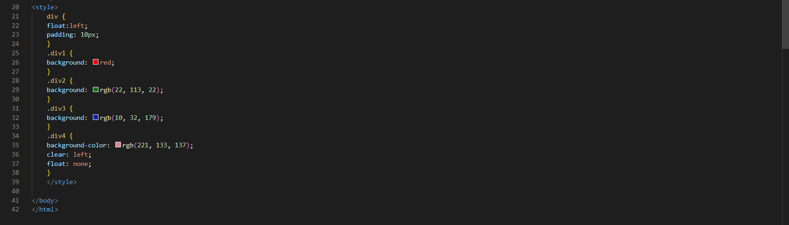

# Lab4WEB
## Langkah - langkah Praktikum
### Box Element
Untuk membuat sebuah box element bisa menggunakan tag `
` seperti berikut.

`<section>` 

    `
Div 1
` 

    `
Div 2
` 

    `
Div 3
` 

`</section>`

### CSS Float Property
Untuk Membuat CSS Float tambahkan deklarasi CSS pada head untuk membuat Float Element, seperti berikut.

### Mengatur Clearfix Element
Clearfix Element digunakan untuk mengatur element setelah float element. Property digunakan untuk mengaturnya.

Tambahkan element div lainnya seteleah div3 seperti berikut.

`<section>` 

    `
Div 1
` 

    `
Div 2
` 

    `
Div 3
` 

    `
Div 4
` 

`</section>` 

Kemudian atur property clear pada CSS, seperti berikut.

.div4 { 

background-color: blue; 

clear: left; 

float: none; 

} 

Selanjutnya buka browser dan refresh kembali. 

