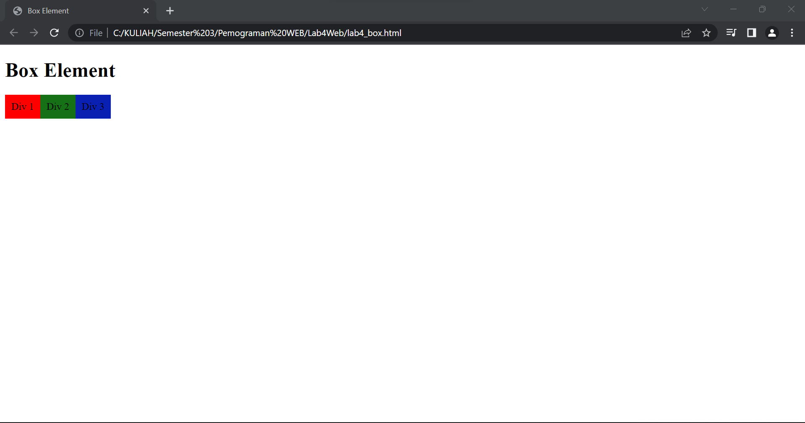
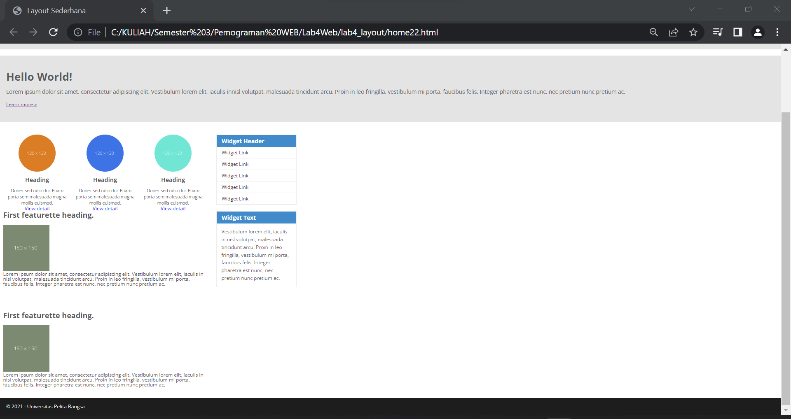

# Lab4WEB
## Langkah - langkah Praktikum
### Box Element
Untuk membuat sebuah box element bisa menggunakan tag `
` seperti berikut.

`<section>` 

    `
Div 1
` 

    `
Div 2
` 

    `
Div 3
` 

`</section>`

### CSS Float Property
Untuk Membuat CSS Float tambahkan deklarasi CSS pada head untuk membuat Float Element, seperti berikut.

Kemudian jalankan HTML yang baru dibuat untuk melihat hasilnya.

### Mengatur Clearfix Element
Clearfix Element digunakan untuk mengatur element setelah float element. Property digunakan untuk mengaturnya.

Tambahkan element div lainnya seteleah div3 seperti berikut.

`<section>` 

    `
Div 1
` 

    `
Div 2
` 

    `
Div 3
` 

    `
Div 4
` 

`</section>` 

Kemudian atur property clear pada CSS, seperti berikut.

`.div4 {` 

`background-color: blue;` 

`clear: left;` 

`float: none;` 

`}` 

Selanjutnya buka browser dan refresh kembali. 

Lakukan percobaan terhadap penggunaan property clear dengan nilai lainnya (left, both, right) dan amati perubahannya.

### Membuat Layout Sederhana
Membuat Layout dengan sederhana seperti dibawah ini.

Buat folder baru dengan nama lab4_layout, kemudian buatlah file baru didalamnya dengan nama home.html, dan file css dengan nama style.css Kemudian tulis kode berikut.

 

Kemudian buka browser dan lihat hasilnya. 

 

Kemudian tambahkan kode CSS untuk membuat layoutnya. 

 

Kemudian lihat hasilnya pada browser. 

### Membuat Navigasi
Kemudian selanjutnya mengatur navigasi. 

 

Kemudian lihat hasilnya. 

### Membuat Hero Panel
Selanjutnya membuat hero panel. Tambahkan kode HTML dan CSS seperti berikut. 

 

 

Kemudian jalankan HTML dan lihat hasilnya.

### Mengatur Layout Main dan Sidebar
Selanjutnya mengatur main content dan sidebar, tambahkan CSS float.

### Membuat Sidebar Widget
Kemudian selanjutnya menambahkan element lain dalam sidebar.

 

Kemudian tambahkan CSS.

 

Kemudian Lihat Hasilnya

### Mengatur Footer
Selanjutnya mengatur tampilan footer. Tambahkan CSS untuk footer.

`/* footer */` 

`footer {` 

`clear:both;` 

`background-color:#1d1d1d;` 

`padding:20px;` 

`color:#eee;`

`}` 

### Menambahkan Elemen lainnya pada Main Content
 

Kemudian tambahkan CSS. 

 

Kemudian lihat hasilnya

### Menambahkan Content Artikel
Selanjutnya membuat content artikel. Tambahkan HTML berikut pada main content. 

 

Kemudian tambahkan CSS. 

 

SELESAI.

